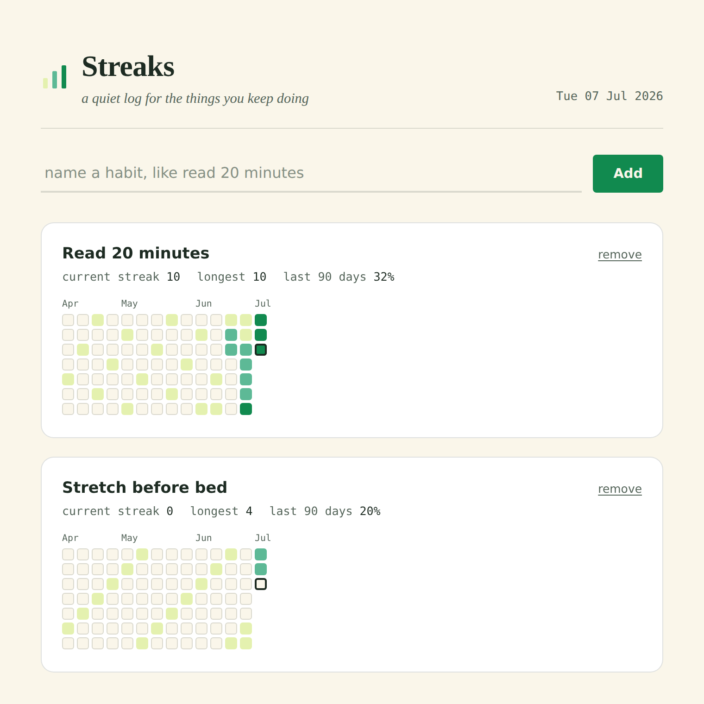

# Streaks

A small, local habit tracker. Add the habits you are trying to keep, mark a day once you have done it, and watch the shading build as a streak grows.



## Why this one

Most habit trackers just mark a day as done or not done. Streaks instead colors every day by how many days in a row the habit had already been kept as of that day. A single day off is pale, a few days in a row moves to teal, a week or more turns forest green. The moment a streak breaks, the color drops straight back down. The grid ends up reading like a small story of momentum gained and lost, not just a checklist.

The four colors are not a separate design choice from the data. They are the exact palette used throughout the page, reused as the four levels of the heatmap.

## Features

- Add and remove habits, each with its own history
- Click any past or present day to mark it done or undo it
- A 13 week heatmap per habit, with month labels, in the style of a contribution graph
- Current streak, longest streak, and completion rate for the last 90 days, per habit
- Everything is saved to `localStorage`, so your log is still there next time you open the page
- No build step, no dependencies to install, works from a single static folder

## Using it

Open `index.html` in a browser, or visit the GitHub Pages link for this project. Type a habit name, press Add, and click today's cell once you have done it. Click a cell again to undo it. Click "remove" on a habit to delete it and its full history, after a confirmation.

Nothing is sent anywhere. The log lives only in the browser you are using, on the device you are using it on. Clearing your browser's site data for this page will clear the log along with it.

## Built with

Plain HTML, CSS, and JavaScript. No frameworks, no build tools, no external JavaScript libraries. The only external resources are the Google Fonts used for type (Fraunces, IBM Plex Sans, IBM Plex Mono).

## Files

```
habit-tracker/
  index.html      structure and copy
  style.css       palette, type, and layout
  script.js       storage, streak math, and the heatmap renderer
  README.md       this file
  screenshot.png  preview used above
```

## Running locally

No install needed. Clone the repository and open `habit-tracker/index.html` directly in a browser, or serve the folder with any static file server, for example:

```
npx serve habit-tracker
```

## Part of mini-projects

This is one of several small, self-contained tools in this repository, alongside the weather app, tuner, spinner wheel, QR generator, and focus timer. Each project is a single static page meant to be dropped straight onto GitHub Pages.
